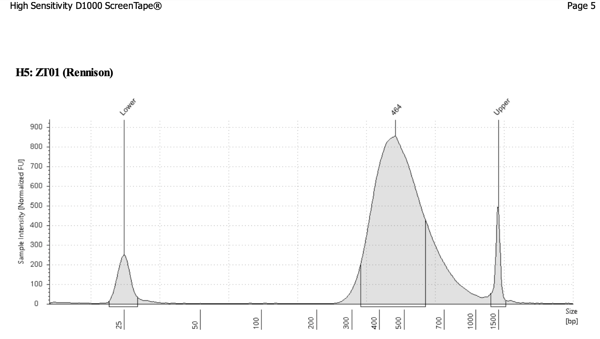

## 9/18/24 Extractions, BRB-seq sample submission, TapeStation

Will update more later b/c running out the door to drop off package at FedEx for Davis. TapeStation looks good (peak 464bp). Did 48 extractions today. Started 48 more for tomorrow. Submitting 
samples to Davis today. 

Here is the tapestation trace for the gill deep sequencing library BRB-seq.

